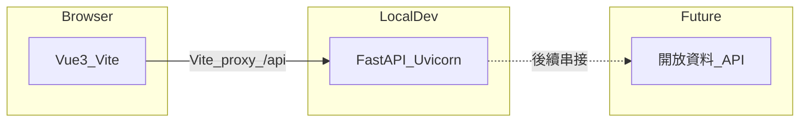

# 系統架構（初始骨架）

## 目標

整合開放資料與即時定位，優化高雄市垃圾車查詢體驗。本文件描述 **Monorepo 初始階段** 的技術邊界；地圖、推播、使用者帳號等將在後續迭代補上。

## 元件與資料流

| 層級 | 技術 | 職責 |
|------|------|------|
| 前端 | Vue 3、Vite、TypeScript、Vue Router、Pinia | SPA、地圖與 UI（後續） |
| 後端 | FastAPI、Uvicorn | API 閘道、快取、與開放資料對接（後續） |
| 開發 | 根目錄 `npm run dev` | 以 `concurrently` 並行啟動前後端 |

開發時，瀏覽器只與 Vite 開發伺服器通訊；以 `/api` 前綴的請求由 Vite **proxy** 轉發至 `http://127.0.0.1:8000`，避免瀏覽器 CORS 與硬編碼後端網址。

## 後續待辦（計畫書對齊）

- **推播**：到站前通知（條件：距離／時間）。
- **我的最愛**：常用站牌儲存與首頁摘要。
- **清運類型**：一般垃圾／資源回收／廚餘之視覺化。
- **無障礙**：深色模式、大字體、高對比。
- **API 契約**：穩定後可自 OpenAPI 產生前端 TypeScript 型別（例如 `openapi-typescript`）。

## 相關路徑

- 前端：[frontend/](../frontend/)
- 後端：[backend/](../backend/)
